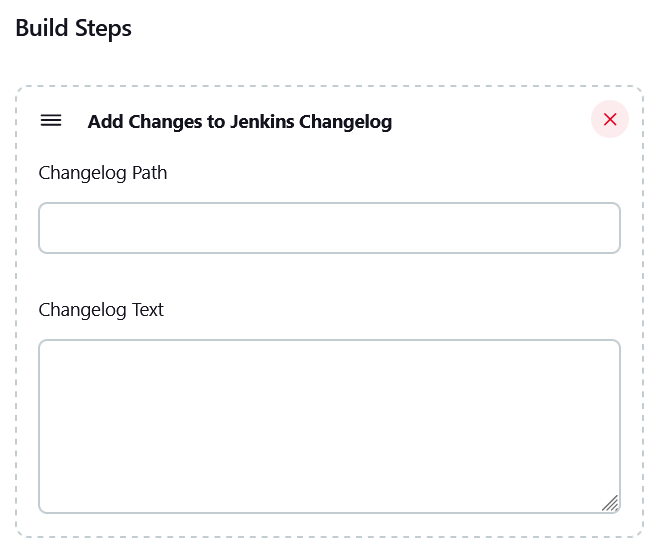

[](https://ci.jenkins.io/job/Plugins/job/add-changes-to-build-changelog-plugin/job/main/)
[](https://github.com/jenkinsci/add-changes-to-build-changelog-plugin/actions/workflows/cd.yaml)

# Add Changes to Build Changelog Plugin

## About

This plugin was aimed at adding changes to a Jenkins build that didn't come from SCM information. Maybe the changes were calculated outside of Jenkins, but someone wanted to show those changes in the Jenkins UI. 

## Target Audience

Stack Overflow had a lot of questions regarding adding custom changes to the Jenkins change log, but there was no easy way to do this.  Most relied on knowing the Jenkins internals and scripting.  Thus, this plugin was created to help.

For example, here are some of those questions:

[Jenkins - Updating build changelog during build step](https://stackoverflow.com/questions/14047974)

[Is there a way to set/change the changeSet (changelog) content from pipeline script? Needed for preflight type of job](https://stackoverflow.com/questions/60565782)

[Generating Custom GitSCM Changelog in Jenkins Pipeline](https://stackoverflow.com/questions/42810248)

[insert custom changelog to Jenkins job](https://stackoverflow.com/questions/44126901)

[Jenkins: Modify the ChangeSet List to have changes since last successful build](https://stackoverflow.com/questions/72911958)

[Jenkins Plugin for Writing to the Change Log?](https://stackoverflow.com/questions/26530840)

## Usage

-   Freestyle Jobs
-   Pipeline

## Pipeline Builds

> **Note**
> Internally, anything you add to the build will be treated as a Git change.

Example pipeline script:
```
node {
    def text = '''
	{
		"changes": [
			{
				"commit": "364cd043160d870b655f66c5925b18b9e14961e1",
				"author": "Jane Doe",
				"email": "jane@doe.com",
				"date": "2023-02-03 07:30:05 +0000",
				"message": "My git change.",
				"paths": [
					{ "path": "hello.txt", "modified": true, "deleted": false, "added": false }
				]
			}
		]
	}
	'''
    
    // Read in the changes via text
    addchangestobuildchangelog changelogText: text
    
    // Read in the changes via file path
    writeFile file: 'changelog.txt', text: text
    addchangestobuildchangelog changelogPath: 'changelog.txt'
}
```

## Freestyle Builds

> **Note**
> At the moment, you can only specify Git SCM as the default checkout type.  The other SCM types (like SVN, etc) are not support yet.  If you want to use this plugin and do not have a git repository, then specify an empty git repository to get around that restriction.

Screenshot:



Example git changelog text:
```
{
	"changes": [
		{
			"commit": "364cd043160d870b655f66c5925b18b9e14961e1",
			"author": "Jane Doe",
			"email": "jane@doe.com",
			"date": "2023-02-03 07:30:05 +0000",
			"message": "My git change.",
			"paths": [
				{ "path": "hello.txt", "modified": true, "deleted": false, "added": false }
			]
		}
	]
}
```

## Contributing

Any and all contributions welcome!

## License

Licensed under MIT, see [LICENSE](LICENSE.md)
